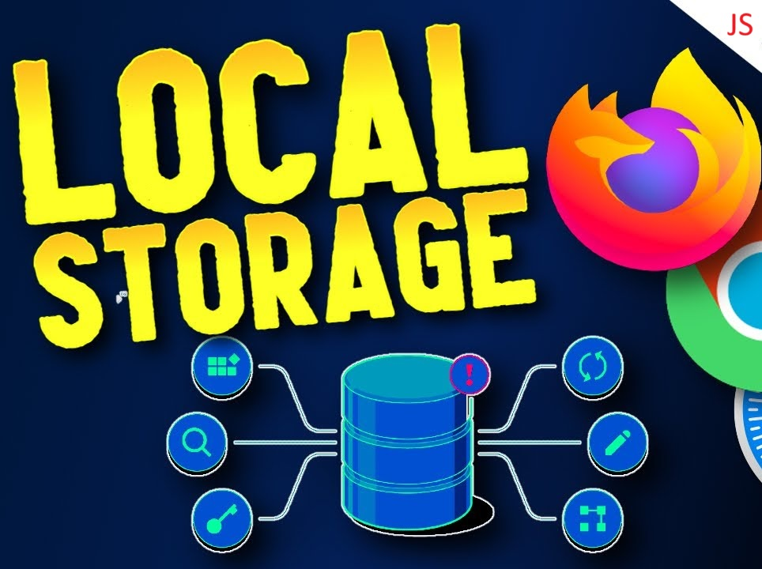
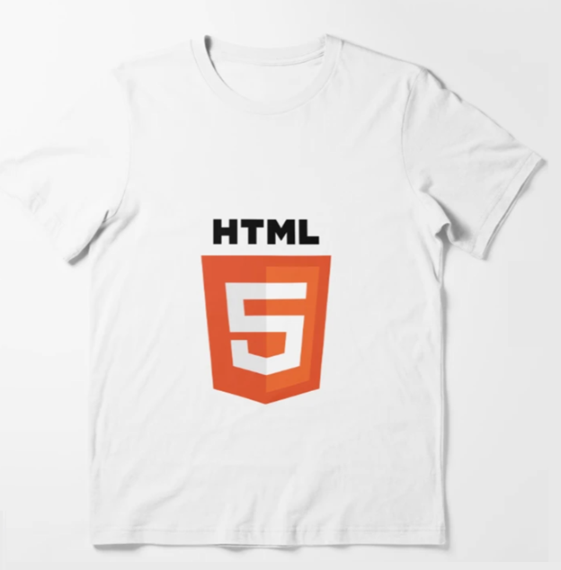

# How to Use the LocalStorage with JavaScript

LocalStorage is a web storage feature provided by modern browsers that allows websites to store data in the user's browser. This data is saved persistently, meaning it remains even after the browser is closed or the user navigates away from the page. Unlike cookies, LocalStorage can store larger amounts of data and is not sent to the server with every HTTP request.

One of the main advantages of LocalStorage is that it enables client-side storage of data, making it a great choice for saving user preferences, session information, or, as in our example, shopping cart data for an e-commerce website.

## Example: Shopping Cart Using LocalStorage

In this example, we will demonstrate a simple, modern e-commerce shopping cart that utilizes LocalStorage to store and manage the cart data. The core functionality includes:

Adding products to the cart: Users can add items to the shopping cart by clicking the "Add to Cart" button for each product.
Storing cart data in LocalStorage: The cart data is saved in LocalStorage, meaning the cart's contents will persist even if the user refreshes the page or closes the browser.
Removing products from the cart: Users can remove items from the cart, and the cart data will be updated both visually and in LocalStorage.
Viewing the cart in a popup: By clicking the cart button in the header, users can view the contents of their cart in a modal popup, with the total price of the items displayed.
This project is a simple, yet practical implementation of LocalStorage for a shopping cart in a web application, demonstrating how you can persist user data on the client side.

## Features

- Product Catalog: Display a grid of available T-shirts with images, descriptions, and prices.

- Shopping Cart: Users can add products to the cart, view the cart contents, and see the total price of their selected items.

- Persistence with LocalStorage: All cart data is saved in the browser's LocalStorage, so it persists even after page refreshes or closing the browser.

- Remove Items: Users can easily remove items from the cart, and the UI will update accordingly.

- Popup Cart Interface: A clean modal that displays the shopping cart, offering an intuitive way to view and manage selected items.

## Technologies Used

- HTML5: For structuring the web page and product catalog.

- CSS3: To style the page, including the product grid, buttons, and modal popup.

- JavaScript (ES6+): To handle functionality, including adding/removing products from the cart and interacting with LocalStorage.

- LocalStorage: For persisting the shopping cart data between page reloads and across browser sessions.

## Setup Instructions

To get started with this project locally, follow these steps:

1. Clone the repository:

    ```
    git clone https://github.com/fabianmendozaospina/shopping-cart.git
    ```

2. Navigate to the project folder:
    
    ```
    cd shopping-cart
    ```

3. Open the index.html file in your browser:

    Simply double-click on the index.html file or open it via a local web server to view the application.

## Code Explanation


### HTML Structure

The `index.html` file is the main structure of the web page, and it consists of the following key sections:

1. Header

    ```
    <header class="header">
        <h1>Dev T-Shirts</h1>
        <button class="cart-button">🛒 Cart (<span class="cart-count">0</span>)</button>
    </header>
    ```

    - The `<header>` contains the main title of the website ("Dev T-Shirts") and a button for accessing the shopping cart.
    - The cart-button button displays the cart icon with the number of items in the cart. The `<span class="cart-count">0</span>` dynamically shows the current count of items in the cart.    

2. Product Catalog

    ```
    <main class="container product-grid">
        <div class="product" data-id="1" data-name="T-Shirt HTML" data-price="15">
            
            <h2>HTML T-Shirt</h2>
            <p class="price">$15</p>
            <button class="add-to-cart">Add to cart</button>
        </div>
        <!-- Similar product entries for CSS and JavaScript T-Shirts -->
    </main>
    ```

    - The `<main>` element contains the catalog of products, displayed using a CSS grid (product-grid).
    - Each product is represented by a `<div class="product">` element containing:
        - A product image (``)
        - A product name and price (`<h2>` and `<p>`)
        - An "Add to Cart" button (`<button class="add-to-cart">`).
    - Each product has a data-* attribute (e.g., data-id, data-name, data-price) to store information about the product that will be used later in the JavaScript.

3. Shopping Cart Popup

    ```
    <div class="cart-popup hidden">
        <h2>Your Shopping Cart</h2>
        <ul class="cart-items"></ul>
        <p class="total">Total: $<span class="cart-total">0</span></p>
        <button class="close-popup">Cerrar</button>
    </div>    
    ```

    - The cart's contents are displayed in a hidden popup (cart-popup). The popup includes:
        - A list (`<ul class="cart-items">`) where the items in the cart will be shown.
        - A `<span class="cart-total">0</span>` to display the total price of the items in the cart.
        - A close button (`<button class="close-popup">`) to close the popup.

### JavaScript Code

The `index.js` file contains the JavaScript code responsible for managing the functionality of the shopping cart. Here’s a breakdown of the key parts:

1. Selecting DOM Elements

    ```
    const cartItemsObj = select('.cart-items');
    const cartButtonObj = select('.cart-button');
    const cartPopupObj = select('.cart-popup');
    const cartCountObj = select('.cart-count');
    const cartTotalObj = select('.cart-total');
    const closePopupObj = select('.close-popup');
    const addToCarButtonsObj = document.querySelectorAll('.add-to-cart');
    ```

    - The `select()` function is used to get references to DOM elements that will be manipulated.
    - `cartButtonObj` refers to the cart button, and `cartPopupObj` refers to the cart popup, for example.
    - `addToCarButtonsObj` selects all the "Add to Cart" buttons.

2. Initializing the Cart

    ```
    let cart = JSON.parse(localStorage.getItem('cart')) || [];
    updateCartUI();
    ```

    - The `cart` variable is initialized by fetching the saved cart data from `LocalStorage`. If no data exists, it starts as an empty array `[]`. Notice the   use of the localStorage object's getItem() method, we pass it the storage key to return the array.
    - `updateCartUI()` is called to display the cart data on the page.

3. Saving the Cart to LocalStorage

    ```
    function saveCart() {
        localStorage.setItem('cart', JSON.stringify(cart));
    }
    ```

    - The `saveCart()` function saves the current `cart` array to `LocalStorage` as a string using `JSON.stringify()`. Notice the use of the localStorage object's setItem() method, we pass it the storage key and the array to save it.

4. Updating the Cart UI

    ```
    function updateCartUI() {
        cartCountObj.textContent = cart.length;
        cartItemsObj.innerHTML = cart
            .map((item, index) => `
            <li>
                ${item.name} - $${item.price}
                <button class="remove-item" data-index="${index}"><i class="fa-regular fa-circle-xmark"></i></button>
            </li>
            `)
            .join('');
        cartTotalObj.textContent = cart.reduce((total, item) => total + item.price, 0).toFixed(2);
        removeProductHandler();
    }
    ```

    - The `updateCartUI()` function updates the cart count and cart total on the page.
    - The `cartItemsObj` is populated with a list of items from the `cart` array. Each item has a "remove" button to allow the user to remove it from the cart.
    - `cartTotalObj` is updated to show the total price of the items in the cart, using the `reduce()` method.

5. Adding Products to the Cart  

    ```
    addToCarButtonsObj.forEach(button => {
        listen('click', button, event => {
            const product = event.target.closest('.product');
            const productId = product.dataset.id;
            const productName = product.dataset.name;
            const productPrice = parseFloat(product.dataset.price);

            cart.push({ id: productId, name: productName, price: productPrice });
            saveCart();
            updateCartUI();
        });
    });
    ```

    - When a user clicks the "Add to Cart" button, this event listener is triggered.
    - It retrieves the product information (ID, name, price) from the data-* attributes of the product element and adds it to the `cart` array.
    - After adding the item to the cart, saveCart() saves the updated cart to LocalStorage, and `updateCartUI()` is called to refresh the UI.

6. Removing Products from the Cart

    ```
    function removeProductHandler() {
        const removeCarButtonsObj = document.querySelectorAll('.remove-item');
        removeCarButtonsObj.forEach(button => {
            button.addEventListener('click', event => {
            const index = event.target.dataset.index;
            cart.splice(index, 1);
            saveCart();
            updateCartUI();
            });
        });
    }
    ```

    - Each product in the `cart` has a "remove" button (❌). Clicking this button removes the item from the cart.
    - `cart.splice(index, 1)` removes the item from the `cart` array, and the updated cart is saved and displayed.


## Conclusion

This project demonstrates how to use LocalStorage to persist shopping cart data in a simple, modern e-commerce web application. It shows how web storage can be utilized to enhance the user experience by maintaining state across sessions, even when the page is refreshed or the browser is closed.

You can extend this project by adding features such as user authentication, a checkout process, or integrating with a backend system for payment processing. The principles demonstrated here, however, lay the foundation for building more complex, client-side storage-based applications.